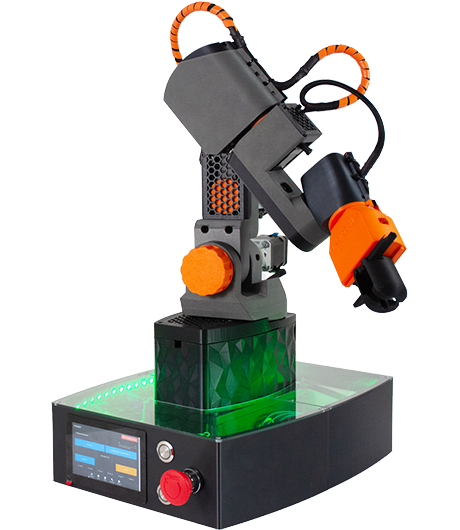

# Benvenuto in PRIMO: il tuo primo passo nella robotica

Benvenuto! Questo sito è dedicato a **PRIMO**, un braccio robotico a 6 assi open‑source progettato per farti scoprire il mondo della robotica industriale. Qui troverai tutte le risorse necessarie per imparare i concetti fondamentali della robotica e applicarli concretamente attraverso l’interazione con un robot reale.

---

## Che cos’è PRIMO

PRIMO è un manipolatore articolato progettato per la didattica. È stampabile in 3D, programmabile, completamente open‑source, e nasce con l'obiettivo di **rendere accessibile l'apprendimento della robotica** in contesti scolastici e formativi.

È pensato per aiutarti a:
- Comprendere come funziona un robot industriale
- Imparare i principi di base del controllo del movimento
- Mettere in pratica concetti teorici con un sistema fisico reale

---

## Cosa imparerai attraverso questo sito

1. **Cos’è un robot** e come si classificano i diversi tipi di manipolatori  
2. **Concetti chiave** come gradi di libertà, cinematica diretta e inversa  
3. **Struttura di un robot articolato** e come ogni parte contribuisce al movimento  
4. **Principi di controllo** e programmazione base  
5. **Esercizi pratici**, simulazioni e movimenti reali  
6. **Approfondimenti** su tematiche moderne della robotica

---

## Perché è importante studiare la robotica oggi

La robotica è ovunque: dalle fabbriche ai magazzini automatizzati, dai robot chirurgici ai bracci meccanici nei laboratori. Comprendere come funziona un robot ti permette di:
- **Sviluppare competenze trasversali** tra meccanica, elettronica e programmazione  
- **Affrontare problemi reali** con approccio ingegneristico  
- **Prepararti alle professioni del futuro**, dove l'automazione sarà sempre più centrale

Studiare robotica non significa solo imparare a costruire un robot, ma soprattutto a pensare in modo sistemico, logico e creativo.

---

## Come usare questo sito passo dopo passo

1. **Parti dalla teoria**: esplora i concetti fondamentali della robotica  
2. **Scopri PRIMO**: analizza come è costruito e quali sono le sue funzionalità  
3. **Prova a programmare**: inizia con esempi guidati  
4. **Sperimenta**: esegui esercizi pratici per applicare quanto appreso  
5. **Approfondisci**: se sei curioso, troverai spunti per esplorare tematiche più avanzate  
6. **Condividi e contribuisci**: PRIMO è un progetto aperto, nato per crescere con la comunità

---

Ti auguriamo buon apprendimento e buon divertimento con PRIMO!  
Comincia dal primo capitolo: _"Cos’è la robotica"_.
